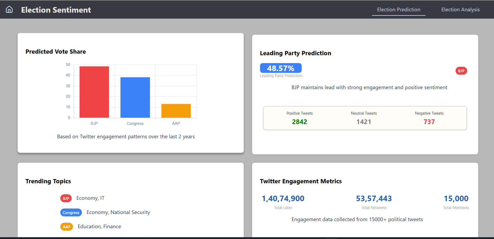
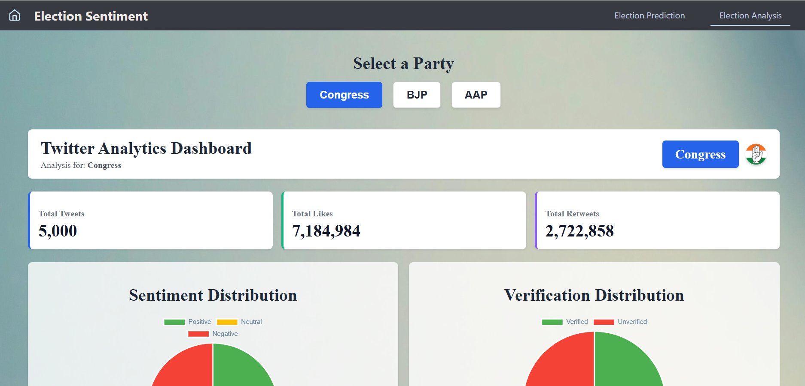
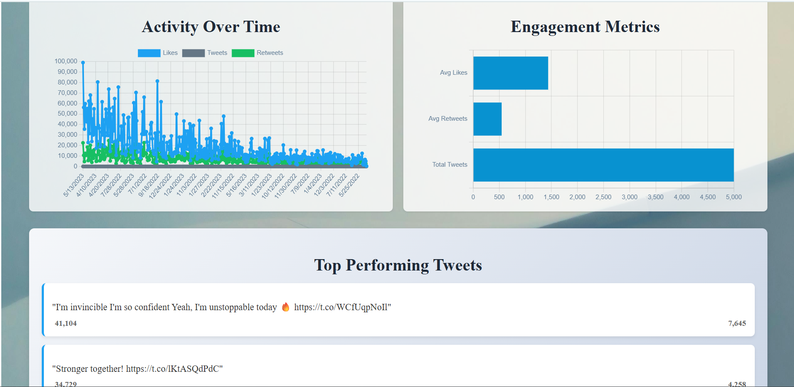

# Election Prediction System

A MERN (MongoDB, Express.js, React.js, Node.js) based web application that analyzes political sentiment from Twitter data and predicts election outcomes for major Indian parties (BJP, Congress, AAP).

## Project Structure

```
client/
└── src/
    ├── Election-Analysis/
    ├── Election-Prediction/
    ├── App.js
    └── index.js
server/
    ├── controller/
    ├── model/
    ├── router/
    ├── views/
    ├── public/
    ├── connection.js
    └── index.js
model/
    └── ML models
```

## Features

-  Sentiment Analysis of tweets from political parties
-  Machine Learning-based prediction of election outcome
-  Interactive data visualizations
-  Secure backend APIs using Express.js
-  Deployed via Vercel

## Tech Stack

| Tech             | Description                       |
|------------------|------------------------------------|
| React.js         | Frontend UI                       |
| Node.js + Express| Backend API server                |
| MongoDB          | NoSQL Database                    |
| Python           | Sentiment analysis model          |
| Vercel           | Deployment                        |
| CSV              | Data source (tweet data)          |

## Setup Instructions

### 1. Clone the repository

```bash
git clone https://github.com/Zkiel013/Twitter-Sentiment-Analysis-Election-Forecast.git
cd Twitter-Sentiment-Analysis-Election-Forecast
```

### 2. Install dependencies

For client:
```bash
cd client
npm install
```

For server:
```bash
cd server
npm install
```

### 3. Set up environment variables

Create a `.env` file inside `/server` and  `/client` if not already:

```env(server)
PORT=5000
MONGO_URI=your_mongodb_connection_string
```
```env(client)
PORT=3000
REACT_APP_API_URL=http://localhost:5000
```
### 4. Run the app

```bash
# In one terminal (backend)
cd server
npm start

# In another terminal (frontend)
cd client
npm start
```

App will run on:

- Frontend: `http://localhost:3000`
- Backend: `http://localhost:5000`

## ML Model

- Preprocessed tweet data for BJP, Congress, and AAP
- Sentiment scoring using TextBlob / VADER
- Output stored in MongoDB
- Visualization via React

## 🖼️ Project Screenshot




## Contributing

1. Fork the repository
2. Create a new branch
3. Commit your changes
4. Push to your branch
5. Create a Pull Request
